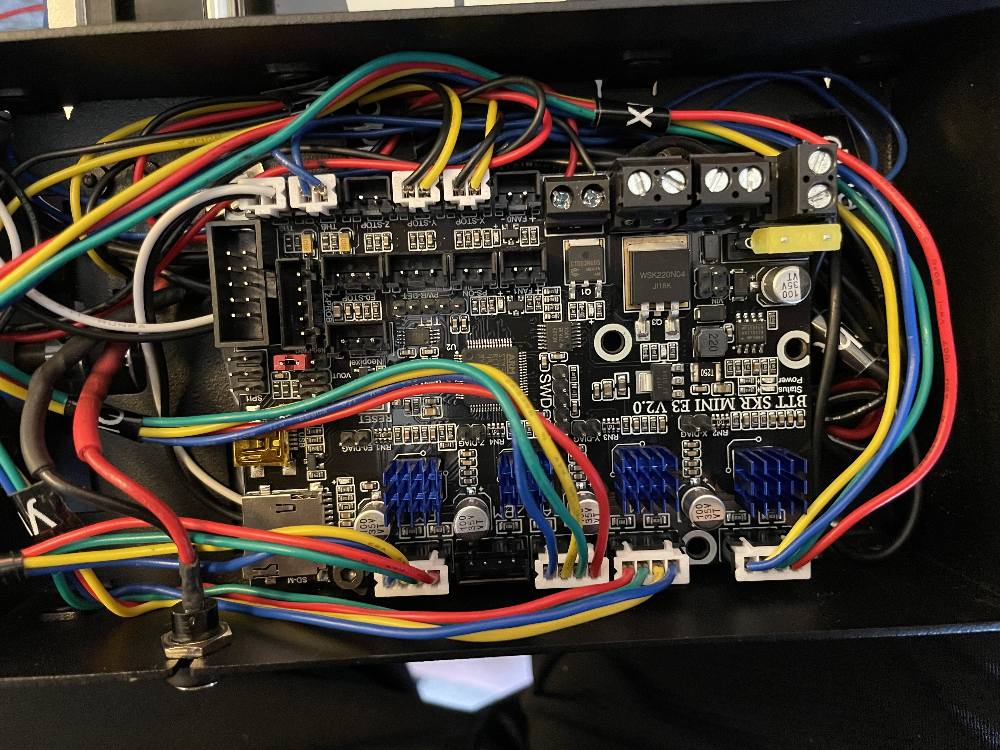

<p align="center"></p>

<h1 align="center">BTT SKR Mini E3 V2 Printer Board on a Printrbot Simple Metal</h1>


## Marlin 2.1

Using the latest version of Marlin, 2.1 at the time of this build.

## Replaced Hardware [M12 4mm Sensing DC 5V NPN NO]

The inductive sensor on the Printrbot Simple Metal is a 12v Inductive Sensor, you need to replace it with a 5v NPN NO inductive sensor, they are like 10$ for 2 from Amazon.

## ZSTOP Swap for YSTOP

There is an issue with the ZSTOP on the SKR series, it wouldn't recognize when the inductive sensor was triggered.  Wiring up the above inductive sensor to the ZSTOP (Signal/Ground) and +5v on the ZPROBE port, the light on the sensor would light up but Marlin continued to state it was open.  I tried swapping it to the YSTOP and it worked.  So I updated the following file to swap the pins of YSTOP and ZSTOP.

# src/pins/stm32f1/pins_BTT_SKR_MINI_E3_common.h

# Changed This
```
#define Y_STOP_PIN                          PC14
#define Z_STOP_PIN                          PC15
```
 
# To this

 ```
#define Y_STOP_PIN                          PC15
#define Z_STOP_PIN                          PC14
```

## Wiring Picture

<div align="center">
  
</div>